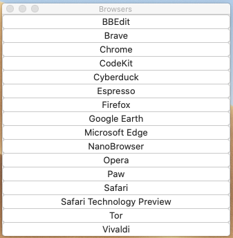

# Let’s Do Launch
## A simple launcher app for macOS/OSX.

All the app launchers and Finder dock enhancements out there are way more than I need: I just wanted simple app(s) that could each be configured with their own icons in the dock, and which would show a simple floating window when opened/activated, and then hide themselves once a button in the window had been clicked. And nothing out there seemed to do this simple thing.

So I knocked this up.

It's years old, and because I wrote it just for myself, it's no doubt missing a few bells and whistles that would improve it. But it always did just what I wanted from it, no more and no less.

I've gone through it and tried to tidy up the worst bits. It still works on my Catalina install (10.15.7), although admittedly I have all the security stuff turned off.

I've not tested it on more modern versions of macOS, and I suspect it wouldn't work, as the security/sandboxing requirements from Apple have only got more and more onerous as time has passed.

(Remember when Apple advertising mocked Microsoft for the number of times security dialog boxes would pop up in Windows? Bet that doesn't seem as funny now...)

The build process creates apps with custom icons:

Launching gives you a floating window with whatever items you configured:

When I first put this together buttons could launch apps, documents, and do a load of command line/Terminal stuff. After a few years I realised that I never used the Terminal options, so I stripped them all out.

A button can launch an app, or it can be a mailto: or http:// (or https://) for initialising a new email in Mail or going to a website in Safari.

## Building it all yourself

If you are downloading the source and building it all yourself, there's two steps.

First, you need to build the "template" launcher app. This is the small app that is then used as the basis for the customised versions that are produced during the main build process.

This is the template.xojo_xml_project in the launcher app template subdirectory.

Once you've built that (it's also compressed down into a zip archive) you go to the main launcher app: the launcher manager.xojo_xml_project project in the launcher manager subdirectory.

Building this uses the zip archive produced above.

It's within this main app that you now configure your launchers. You can have multiple launchers, each with as many items as your screen can accomodate. When you select "Build" from the "File" menu, the Template.zip app is cloned to your build destination, your custom icon is installed, and the app name is changed. Now you've got a nice simple and convenient app launcher that can be put it your dock, or wherever else you like.

## Prebuilt disk image

Alternatively, you can just download a disk image with a prebuilt version I've compiled here:

[Let's Do Launch install disk image](https://dl.dropboxusercontent.com/s/wzz0g6qyi0qbeu9/LetsDoLaunch.dmg.zip?dl=0)

It works on my system, as of today (Thursday 31at March 2022), but who knows what the future will bring.

